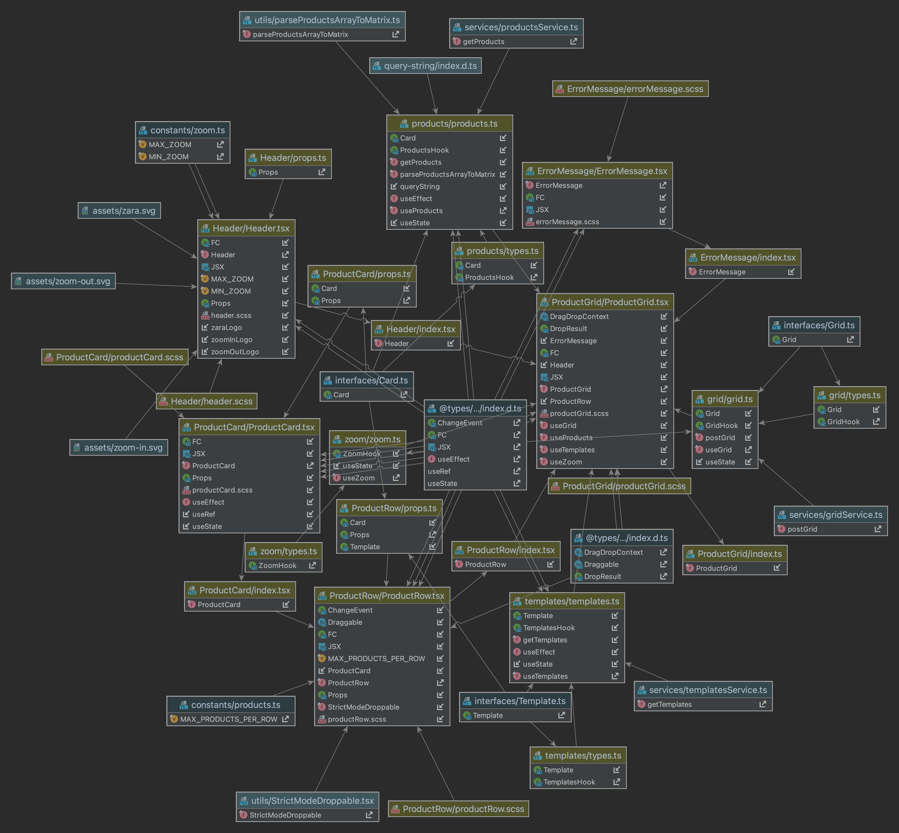

# ZaraStore

This project was generated with Vite Create using React 18.2, Typescript and Jest for the unit tests.

This is the general architecture of the application

## Getting started
1. To ensure that you have `Node 16.13.0`. We recommend to use `nvm`, so you can run `nvm use` to select the correct node version based on the `.nvmrc` file.
2. Run `npm install`.
3. Run `npm start`. That way, you start the local database that uses json server and the local server.
4. Go to `localhost:5173` and enjoy the app.

## Running unit tests
Unit tests are based on Jest, you just have to run `npm run test`.

## Running storybook
1. Run `npm run storybook`.
2. Go to `localhost:6006` and enjoy the stories.

## General considerations
 
### Header elements
This block has 4 clickable elements: `Zoom-in`, `Zoom-out`, `Add` and `Save`.

#### Add
This button is disabled when there are the same number of rows than products.

#### Save
This button is disabled when there is any row without elements.

#### Products zoom
We have 2 constants to control the zoom of the products, `MAX_ZOOM` and `MIN_ZOOM`, and we have 2 buttons to control the zoom of the products, `+` and `-`.
You can find them in the file `src/constants/zoom.ts`.
In function of both defined values we deactivate the buttons

### Row limits
- Users can do drag drop products between rows, but they can't drag a product to a row that has the max number of allowed products. This is configured by the constant `MAX_PRODUCTS_PER_ROW`, you can find them in the file `src/constants/products.ts`.
- When a new row is created always it's created with center alignment.
- Users can move row using the buttons up and down of every row, those buttons are disabled when the row is in the first or last position respectively.
- Users can select the alignment of the row using the selector options left, center and right of every row.
